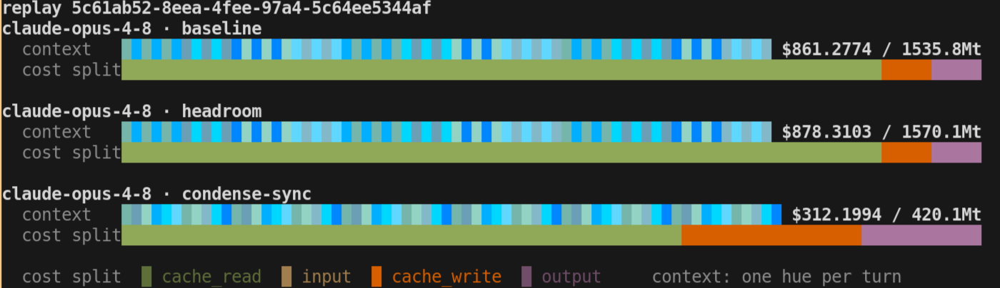
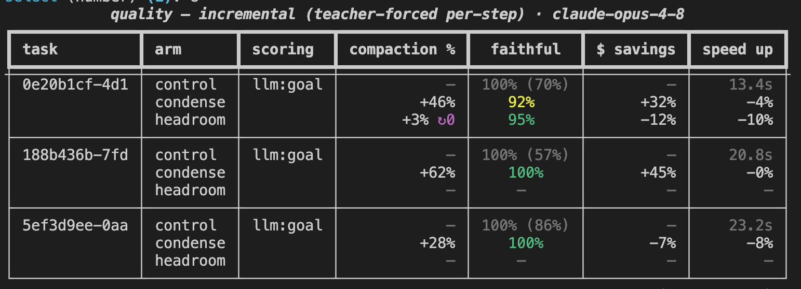

# **minmax<span color="blue">-bench</span>**

**A battlefield for cost-saving strategies.**

Were tokens saved? Were dollars saved? Was quality kept?

<!-- TODO(img): hero — screenshot/GIF of `minmax-bench replay` (animated context + cost evolution TUI) -->


## How it works

**minmax<span color="blue">-bench</span>** consists of two benchmark types:

- **cost** — the **minimize target**: analyzes how many tokens a given **strategy**
  saves, and how much of that survives as actual dollars. The analysis is cache-aware —
  with a suboptimal strategy you can save tokens yet end up with a *larger* bill, because
  breaking the prompt cache trades cheap cache-reads for expensive cache-writes.
  → [docs/cost.md](docs/cost.md)

- **quality** — the **maximize target**: analyzes how well the agent's trajectory is
  preserved under a given **strategy** compared to a control. This comes in two flavors:
  - **full** — run complete trajectories and compare them. Closest to reality, but
    requires a number of reruns to eliminate variance.
  - **incremental** — a more deterministic analysis: does the model produce the same
    step given identical pre-/post-**strategy** input?

  → [docs/quality.md](docs/quality.md)

Cost tells you what a strategy saves; quality tells you whether those savings are real —
a method that makes the agent take more turns pays back its "savings" with interest.
Read them together.

## Strategies

The contenders, and how they line up
(full mechanics: [docs/architecture.md](docs/architecture.md)):

| strategy | what it does | source | mode | transport |
|---|---|---|---|---|
| `baseline` | uncompressed control — everything is scored against it | built-in | — | — |
| `upstream` | direct call to the provider; live cache-aware baseline | built-in | proxy | anthropic, bedrock |
| `headroom` | compression proxy, cache-optimized: freezes prior turns for prefix-cache hits | [headroom-ai](https://pypi.org/project/headroom-ai/) | proxy, rewrite | anthropic, bedrock |
| `headroom-kompress` | the same proxy in token mode: Kompress rewrites history for max compression | [headroom-ai](https://pypi.org/project/headroom-ai/) | proxy, rewrite | anthropic, bedrock |
| `condense-sync` | whole-conversation compaction, blocking until it lands | [condense.chat](https://condense.chat) | proxy, rewrite\* | anthropic, bedrock |
| `condense-async` | compaction in the background, paced by realistic think time | [condense.chat](https://condense.chat) | proxy, rewrite\* | anthropic, bedrock |

Legend:

- **\*** — organization account only.
- **mode** — how a strategy is measured (cost bench only). **proxy** sends the real
  request through the strategy's proxy to the provider — real usage, real costs.
  **rewrite** uses the strategy's rewrite API and simulates caching locally — run a much
  larger dataset without incurring major costs.
- **transport** — the provider API used for the bench's own model calls: the
  **Anthropic API** (with an API key *or* your **Claude subscription** login) or
  **AWS Bedrock**.

## Install

Requires [uv](https://docs.astral.sh/uv/) and Python ≥ 3.11.

```bash
uv sync                       # core
uv sync --extra hf            # + HuggingFace loaders for the SWE-chat dataset
uv run minmax-bench setup     # guided: detect creds, fill in keys, write .env
```

`setup` walks you through Anthropic access (API key **or** Claude Code login), the
condense arm (`dense login`), and the optional dataset token. `minmax-bench info` shows
the resolved state at any time. Prefer manual? `cp .env.dist .env` and fill in only what
you run.

## Quick start

No keys? The offline demo re-scores and replays the committed reference runs:

```bash
uv run minmax-bench report 202f98bd-a2f1-4390-8307-658b451b7727   # per-bucket tables
uv run minmax-bench replay 202f98bd-a2f1-4390-8307-658b451b7727   # animated evolution
uv run minmax-bench strategies                                    # list the matrix
```

With keys, each bench has a guided run (`minmax-bench run` is the front door that asks
which one you want):

```bash
uv run minmax-bench run               # wizard: type, dataset, strategies, model, mode/transport
uv run minmax-bench cost run          # wizard: dataset, strategies, model, mode/transport
uv run minmax-bench quality run       # wizard: arms, tasks, model, k, budget → confirm
```

Or drive them with flags:

```bash
# cost: the clean head-to-head, truncated under Haiku's 200k cap
uv run minmax-bench cost run -d swe-chat:32 \
  -s headroom -s headroom-kompress -s condense-async \
  -m claude-haiku-4-5 --token-budget 190k

# cost, zero model spend: rewrite mode simulates caching locally
uv run minmax-bench cost run -d swe-chat:64 -s condense-sync -s headroom --mode rewrite

# quality: how would YOUR session have played out under condense?
uv run minmax-bench quality incremental
```

> **Proxy runs cost real money** — you pay for the input tokens of every replayed turn.
> Iterate with `--limit`, `--token-budget`, or `--mode rewrite`.

## See cached results

`runs/` ships three committed **reference runs** — every number recomputes from stored
usage, no keys, no network, zero spend:

```bash
uv run minmax-bench report 202f98bd-a2f1-4390-8307-658b451b7727
uv run minmax-bench report cba32b86-99ba-4ed7-bf7c-e385edf2ec99
uv run minmax-bench report 5c61ab52-8eea-4fee-97a4-5c64ee5344af
uv run minmax-bench replay <any of the above>                      # animated
```

<!-- TODO(img): screenshot of the cost report bucket tables (tokens saved / cost saved) -->


- **`run-202f98bd`** — headroom vs headroom-kompress vs condense-async, Haiku 4.5,
  truncated to 190k. The clean head-to-head: condense-async saves **~28%** cost,
  headroom (cache mode) ~14%, headroom-kompress ~2% (token savings die in cache-writes).
- **`run-cba32b86`** — untruncated long sessions (~$73.6 baseline): condense's savings
  *grow* with chain length — 53% in the 400k+ band.
- **`run-5c61ab52`** — Opus 4.8 over 64 sessions / \~11.7k turns in `--mode rewrite`
  (zero spend): condense-sync **\~73% tokens / \~64% cost** (\~$549 off \~$861); headroom
  slightly negative at this scale.

And the quality side — does the agent still do the same work?

<!-- TODO(img): screenshot of the quality report (length/rework/milestone/solve/fid table) -->


Findings so far (impartially, including results unfavorable to condense): preservation
holds on 8/9 tasks; one real exception where condense ~doubles a short task's trajectory
by inducing planning behavior; and token savings ≠ dollar savings — compaction busts the
prompt cache. Details: [docs/quality.md](docs/quality.md).

## Docs

- [docs/cost.md](docs/cost.md) — cost-bench methodology: harness simulation, bucketing, cache modeling, run store.
- [docs/quality.md](docs/quality.md) — quality-bench methodology: noise floor, axes, compaction gate, full + incremental.
- [docs/architecture.md](docs/architecture.md) — how strategies, mode, and transport come together; module map.
