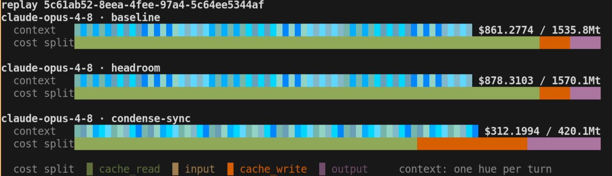
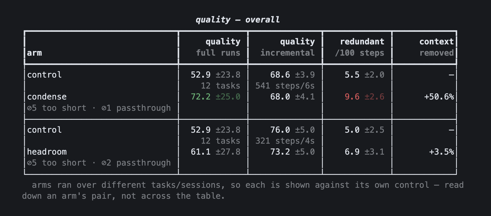

<p align="center">
  <picture>
    <source media="(prefers-color-scheme: dark)" srcset="docs/img/logo-dark.svg">
    
  </picture>
</p>

<p align="center">
  <strong>A battlefield for cost-saving strategies.</strong><br>
  Were tokens saved? Were dollars saved? Was quality kept?
</p>

<p align="center">
  <a href="#how-it-works"><strong>How it works</strong></a> ·
  <a href="#strategies"><strong>Strategies</strong></a> ·
  <a href="#quick-start"><strong>Quick start</strong></a> ·
  <a href="#see-cached-results"><strong>See cached results</strong></a> ·
  <a href="#docs"><strong>Docs</strong></a>
</p>

<p align="center">
  
  
  
  
</p>

---

## How it works

Every context-compression tool advertises token savings. Tokens are not dollars, and
dollars are not the whole story: a strategy that breaks the prompt cache trades cheap
cache-reads for expensive cache-writes, and one that degrades the agent pays back its
"savings" with interest in extra turns. **minmax-bench** runs the same sessions through
each strategy and measures both sides of the trade:

### cost — the *minimize* target

How many tokens a strategy saves, and how much of that survives as actual dollars.
The analysis is cache-aware: **with a suboptimal strategy you can save tokens yet end
up with a larger bill.** Methodology: [docs/cost.md](docs/cost.md).



### quality — the *maximize* target

How well the agent's trajectory is preserved under a strategy, compared to a control.
Two flavors: **full** runs complete trajectories and compares them — closest to
reality, but needs reruns to beat variance; **incremental** is deterministic — does
the model produce the same step given identical pre-/post-strategy input?
Methodology: [docs/quality.md](docs/quality.md).



Nothing is marked better or worse — a Δ bar straddling zero means *indistinguishable
from control at this n*, which is the common outcome and not a pass. Read the quality
columns against **context removed**: an arm at +3.5% next to one at +51% isn't
gentler, it barely fired.

**Cost tells you what a strategy saves; quality tells you whether those savings are
real.** Read them together.

## Strategies

The contenders, and how they line up
(full mechanics: [docs/architecture.md](docs/architecture.md)):

| strategy | what it does | source | mode | transport |
|---|---|---|---|---|
| `baseline` | uncompressed control; everything is scored against it | built-in | n/a | n/a |
| `upstream` | direct call to the provider; live cache-aware baseline | built-in | proxy | anthropic, bedrock |
| `headroom` | compression proxy, cache-optimized: freezes prior turns for prefix-cache hits | [headroom-ai](https://pypi.org/project/headroom-ai/) | proxy, rewrite | anthropic, bedrock |
| `headroom-kompress` | the same proxy in token mode: Kompress rewrites history for max compression | [headroom-ai](https://pypi.org/project/headroom-ai/) | proxy, rewrite | anthropic, bedrock |
| `condense-sync` | whole-conversation compaction, blocking until it lands | [condense.chat](https://condense.chat) | proxy, rewrite\* | anthropic, bedrock |
| `condense-async` | compaction in the background, paced by realistic think time | [condense.chat](https://condense.chat) | proxy, rewrite\* | anthropic, bedrock |
| `caveman` | terse-output skill: shrinks what the agent *writes*, so its own messages accumulate smaller | [caveman](https://github.com/JuliusBrussee/caveman) | skill (quality bench only) | anthropic |

**mode** is how a strategy is measured (cost bench only): **proxy** sends the real
request through the strategy's proxy to the provider — real usage, real costs;
**rewrite** uses the strategy's rewrite API and simulates caching locally, so a much
larger dataset costs next to nothing. **skill** is not a proxy at all — the
intervention runs inside the agent, changing how it writes rather than rewriting its
history, so it has no cost-bench counterpart and is read against plain `vanilla`.
**transport** is the provider API behind the bench's own model calls: the Anthropic
API (API key *or* Claude subscription login) or AWS Bedrock. \* organization account
only.

## Quick start

Requires [uv](https://docs.astral.sh/uv/) and Python ≥ 3.11.

```bash
uv sync                       # core (add --extra hf for the SWE-chat dataset loaders)
uv run minmax-bench setup     # guided: detect creds, fill in keys, write .env
```

`setup` walks you through Anthropic access (API key **or** Claude Code login), the
condense arm (`dense login`), and the optional dataset token. `minmax-bench info`
shows the resolved state at any time. Prefer manual? `cp .env.dist .env` and fill in
only what you run.

No keys? The offline demo re-scores and replays the committed reference runs:

```bash
uv run minmax-bench report 202f98bd-a2f1-4390-8307-658b451b7727   # per-bucket tables
uv run minmax-bench replay 202f98bd-a2f1-4390-8307-658b451b7727   # animated evolution
uv run minmax-bench strategies                                    # list the matrix
```

With keys, each bench has a guided run — `minmax-bench run` is the front door that
asks which one you want:

```bash
uv run minmax-bench run               # wizard: type, dataset, strategies, model, mode/transport
uv run minmax-bench cost run          # wizard: dataset, strategies, model, mode/transport
uv run minmax-bench quality run       # wizard: arms, tasks, model, k, budget → confirm
```

Or drive them with flags:

```bash
# cost: the clean head-to-head, truncated under Haiku's 200k cap
uv run minmax-bench cost run -d swe-chat:32 \
  -s headroom -s headroom-kompress -s condense-async \
  -m claude-haiku-4-5 --token-budget 190k

# cost, zero model spend: rewrite mode simulates caching locally
uv run minmax-bench cost run -d swe-chat:64 -s condense-sync -s headroom --mode rewrite

# quality: how would YOUR session have played out under condense?
uv run minmax-bench quality incremental
```

> **Proxy runs cost real money**: you pay for the input tokens of every replayed turn.
> Iterate with `--limit`, `--token-budget`, or `--mode rewrite`.

## See cached results

`runs/` ships three committed reference runs. Every number recomputes from stored
usage — no keys, no network, zero spend:

```bash
uv run minmax-bench report 202f98bd-a2f1-4390-8307-658b451b7727
uv run minmax-bench report cba32b86-99ba-4ed7-bf7c-e385edf2ec99
uv run minmax-bench report 5c61ab52-8eea-4fee-97a4-5c64ee5344af
uv run minmax-bench replay <any of the above>                      # animated
```

| run | setup | headline |
|---|---|---|
| `202f98bd` | headroom vs headroom-kompress vs condense-async, Haiku 4.5, truncated to 190k | the clean head-to-head: condense-async saves **~28%** cost, headroom (cache mode) ~14%, headroom-kompress ~2% — token savings die in cache-writes |
| `cba32b86` | untruncated long sessions, ~$73.6 baseline | condense's savings *grow* with chain length, reaching **53%** in the 400k+ band |
| `5c61ab52` | Opus 4.8, 64 sessions / ~11.7k turns, `--mode rewrite` (zero spend) | condense-sync **~73% tokens / ~64% cost** (~$549 off ~$861); headroom slightly negative at this scale |

## Docs

- [docs/cost.md](docs/cost.md) — cost-bench methodology: harness simulation, bucketing, cache modeling, run store.
- [docs/quality.md](docs/quality.md) — quality-bench methodology: noise floor, axes, compaction gate, full + incremental.
- [docs/architecture.md](docs/architecture.md) — how strategies, mode, and transport come together; module map.

## Licence

[MIT](LICENSE) — © condense.chat.
